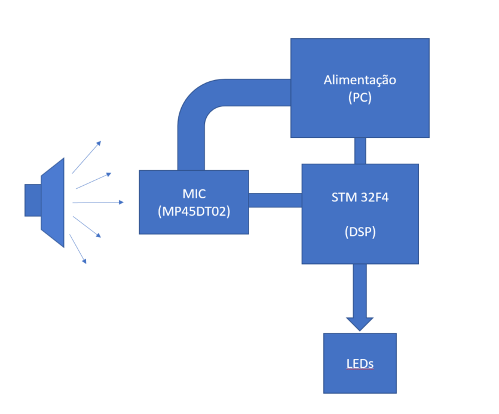
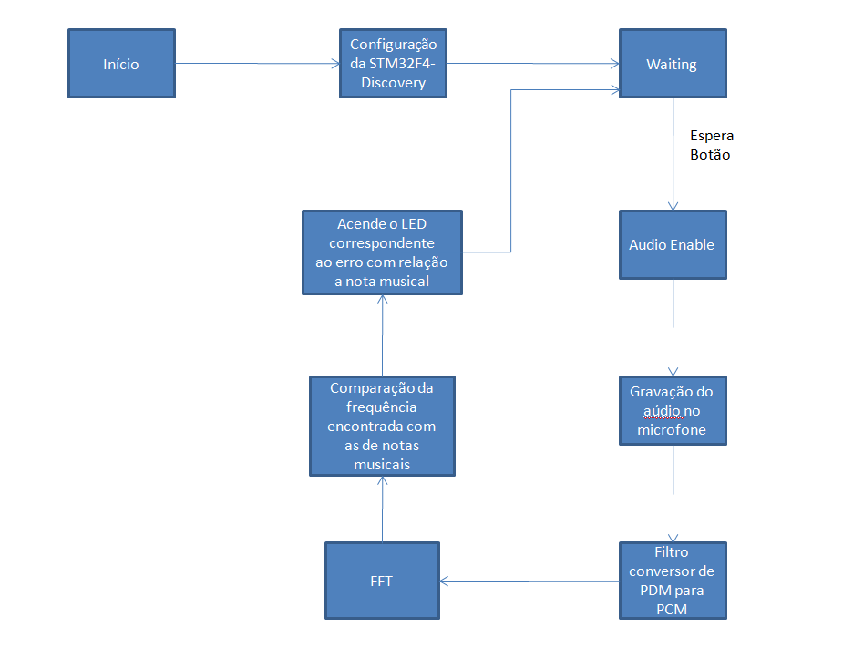

# Paulo Cardoso

# Motivação

Instrumentos de corda desafinam devido a vários fatores no dia a dia, criando a necessidade de afina-los de novo. Além disso em alguns casos é necessário alterar a afinação.
Isso é possível através da audição com um som de referência, porém requer prática. Com isso a proposta é, usando o microfone digital MP45DT02 e a blibioteca de matemática CMIS, fazer um afinador digital através da fft do sinal.

# Periféricos e configuração dos pinos

Será utilizado nesse projeto o microfone MP45DT02 conectado através do I2S.

GPIO10 -> Output push-pull speed 50MHz (Conectado ao clock do microfone)

GPIO3 -> Input(Conectado ao Dout do microfone)

PD12,PD13,PD14,PD15 -> Output(LEDS)

PA0 -> Input(BUTTON USER)

# Diagrama de Blocos

# Fluxograma

